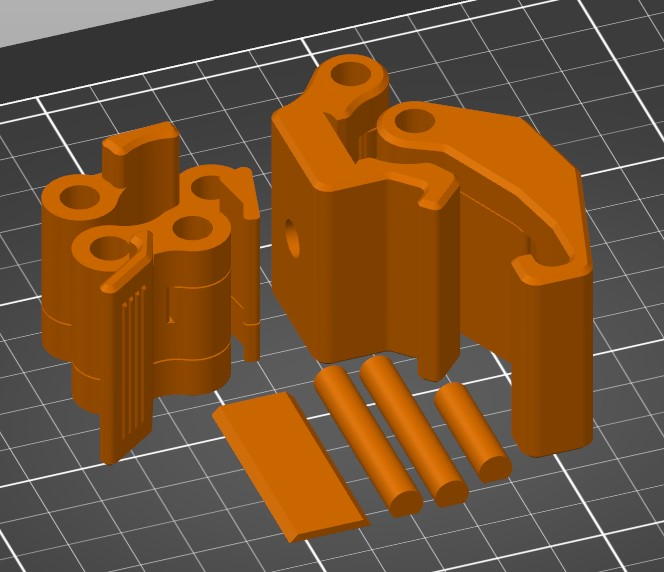

# 3D Print Files
| Component              | Resolution | Infill | Support | Perimeters | Qty |
|-------------------|------------|--------|---------|------------|-----|
| CQC_MainBody      | 0.2 mm     | 20%    | No      | 4          | 1   |
| CQC_SecondaryBody | 0.2 mm     | 20%    | No      | 4          | 1   |
| CQC_LatchArm      | 0.2 mm     | 20%    | No      | 4          | 1   |
| CQC_LeverHandle   | 0.2 mm     | 20%    | No      | 4          | 1   |
| CQC_BoltCover     | 0.2 mm     | 20%    | No      | 4          | 1   |
| CQC_LongPin       | 0.2 mm     | 20%    | No      | 4          | 2   |
| CQC_ShortPin      | 0.2 mm     | 20%    | No      | 4          | 1   |

This design uses built-in supports. They will need to be removed before assembly.
