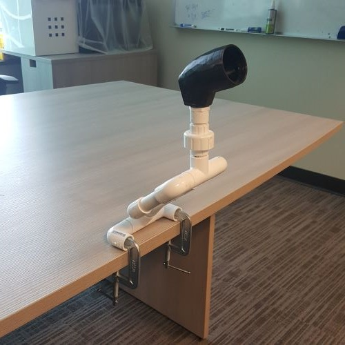

# PAMS - LipSync Desk Mount
The LipSync Desk Mount provides a low cost, adjustable configuration to mount the [LipSync](https://www.makersmakingchange.com/project/lipsync/) to a flat surface like a table or desk. The Lipsync can be attached directly to the  The mount attaches to the surface using two c-clamps, which can be purchased in different sizes to accommodate different desk and table thicknesses.   The LipSync Desk Mount is part of the PVC Assistive Mounting System (PAMS).

The [PVC Assistive Mounting System](TBD) is a collection of readily available commercial-off-the-shelf components and 3D printed components that can be assembled into various configurations to provide mounting solutions for assistive technology.

## More info at
- [Makers Making Change Project Page](https://www.makersmakingchange.com/project/pams-camera-quick-clamp/)
- [Makers Making Change Forum Thread](https://www.forum.makersmakingchange.com)

## Documentation
| Document             | Version | Link |
|----------------------|---------|------|
| Design Specification | WIP     |      |
| Design Rationale     | WIP     |      |
| Bill of Materials    | WIP     |      |
| Assembly Guide       | WIP     |      |
| Maker Checklist      | WIP     |      |
| User Guide           | WIP     |      |
| Changes              | WIP     |      |

## Design Files
[CAD Files](\CAD_Files)

## Build Files
n/a

## License

 LipSync Desk Mount by <a xmlns:cc="http://creativecommons.org/ns#" href="www.makersmakingchange.com" property="cc:attributionName" rel="cc:attributionURL">Neil Squire</a> is licensed under a <a rel="license" href="http://creativecommons.org/licenses/by-sa/4.0/">Creative Commons Attribution-ShareAlike 4.0 International License</a>.

## About Us

Makers Making Change is an initiative of [Neil Squire](https://www.neilsquire.ca/), a Canadian non-profit that helps people with disabilities.

We are committed to creating a network of volunteer makers who support people with disabilities in their communities through 3D printing assistive devices. Check out our library of free, open-source assistive technologies with parts and build instructions.

 - [www.MakersMakingChange.com](https://www.makersmakingchange.com/)
 - [GitHub](https://github.com/makersmakingchange)
 - [Thingiverse](https://www.thingiverse.com/makersmakingchange/about)
 - Twitter: [@makermakechange](https://twitter.com/makermakechange)
 - Instagram: [@makersmakingchange](https://www.instagram.com/makersmakingchange)

## Contact Us

For technical questions, to get involved, or share your experience we encourage you to visit the [MMC Project Page]( https://www.makersmakingchange.com/project/pams-camera-quick-clamp/), [MMC Forum](https://www.forum.makersmakingchange.com), or contact info@makersmakingchange.com
