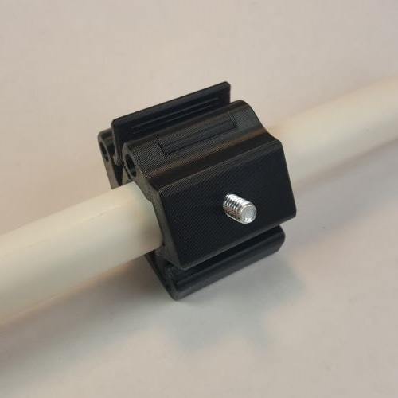

# PVC Assistive Mounting System

The PVC Assistive Mounting System is a collection of readily available commercial-off-the-shelf components and 3D printed components that can be assembled into various configurations to provide mounting solutions for assistive technology.

## Configurations

### LipSync Desk Mount
The [LipSync Desk Mount](/Configurations/LipSync_Desk_Mount/README.md) provides a low cost, adjustable system to mount the [LipSync](https://www.makersmakingchange.com/project/lipsync/) to a flat surface like a table or desk.

### Small Button Mount
The [Small Button Mount](/Configurations/Small_Button_Mount/README.md) is a simple, inexpensive mounting solution to position a small button on a flat surface.

### Large Button Mount
Work-in-progress

## Components
### Camera Quick Clamp
The [PAMS Camera Quick Clamp](Components/PAMS_Camera_Quick_Clamp/README.md) is a 3D printed adapter for attaching an assistive device to a section of 1/2 inch PVC piping. The clamp has a ¼”- 20 UNC camera thread stud that is compatible with various assistive devices and/or camera mount adapters. The clamp can easily be installed, adjusted, and removed by hand.

### Super Clamp Adapter
Work-in-progress

### Round Tubing Clamp
Work-in-progress

### Wheelchair Rail adapter
Work-in-progress

## Resources
More information for working with PVC: [PVC Resources](/Resources/README.md)

## License
 PVC Accessible Mounting System by <a xmlns:cc="http://creativecommons.org/ns#" href="www.makersmakingchange.com" property="cc:attributionName" rel="cc:attributionURL">Neil Squire</a> is licensed under a <a rel="license" href="http://creativecommons.org/licenses/by-sa/4.0/">Creative Commons Attribution-ShareAlike 4.0 International License</a>.

<!-- ABOUT MMC START -->
## About Makers Making Change

Makers Making Change is a program of [Neil Squire](https://www.neilsquire.ca/), a Canadian non-profit that uses technology, knowledge, and passion to empower people with disabilities.

Makers Making Change leverages the capacity of community based Makers, Disability Professionals and Volunteers to develop and deliver affordable Open Source Assistive Technologies.

 - Website: [www.MakersMakingChange.com](https://www.makersmakingchange.com/)
 - GitHub: [makersmakingchange](https://github.com/makersmakingchange)
 - Bluesky: [@makersmakingchange.bsky.social](https://bsky.app/profile/makersmakingchange.bsky.social)
 - Instagram: [@makersmakingchange](https://www.instagram.com/makersmakingchange)
 - Facebook: [makersmakechange](https://www.facebook.com/makersmakechange)
 - LinkedIn: [Neil Squire Society](https://www.linkedin.com/company/neil-squire-society/)
 - Thingiverse: [makersmakingchange](https://www.thingiverse.com/makersmakingchange/about)
 - Printables: [MakersMakingChange](https://www.printables.com/@MakersMakingChange)

### Contact Us
For technical questions, to get involved, or to share your experience we encourage you to [visit our website](https://www.makersmakingchange.com/) or [contact us](https://www.makersmakingchange.com/s/contact).
<!-- ABOUT MMC END -->
